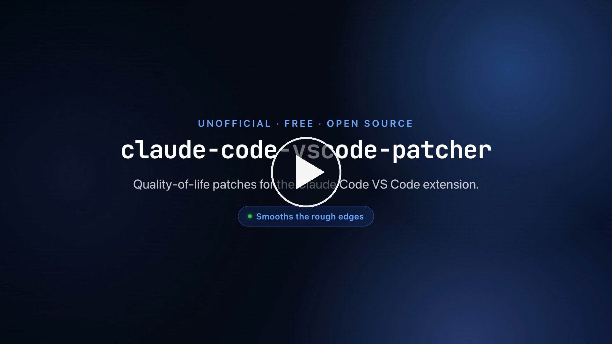

# claude-code-vscode-patcher

Quality-of-life patches for the **Claude Code VS Code extension** — applied to
your own installed copy, and automatically re-applied every time the extension
updates.

> ⭐ **If this saves you some friction, please star the repo.** A star is the
> main signal that tells other Claude Code users this exists.

---

## Watch it — the 35-second tour

[](https://youtu.be/cKkqIAqnBeU)

*Click the image to play the 35-second tour.*

---

## What it is

The official Claude Code VS Code extension is good, but it ships with a handful
of rough edges — tiny attachment thumbnails, accidental click-to-open on tool
output, an `@` mention search that buries the folder you actually want, and
more.

This is a **patcher**. It rewrites the extension's own bundled CSS and
JavaScript, in place, on your machine, to fix those things. It is **not an
extension and not a fork** — it ships zero Anthropic code. It is one readable
Python file that makes small, surgical, reversible edits to files already on
your disk.

Anthropic re-releases the extension roughly once a day, and every release
recreates the bundle from scratch — wiping any edit. So the repo also includes
a **watcher** that re-applies the patches automatically whenever a new version
lands (macOS).

---

## ⚠️ Disclaimer — please read

- **Unofficial.** Not affiliated with, authorized by, or endorsed by Anthropic.
  "Claude Code" and "Claude" are Anthropic trademarks, used here only
  descriptively to say what this tool works on.
- It **modifies files inside your installed extension.** Every file it touches
  is backed up first to a timestamped `.bak` file beside it. To undo a patch,
  restore the backup or reinstall the extension.
- An extension update wipes the patches until the watcher (or you) re-applies
  them. A future release can also change the bundle enough that a patch no
  longer matches — the patcher reports that clearly and skips it. It does not
  corrupt anything.
- **If you hit a bug, revert to a clean extension before reporting it to
  Anthropic.** A patched install is not their build, and an unexplained patched
  install muddies their bug triage.
- **No network calls, no telemetry.** Read `patch-extension.py` before you run
  it — that is the whole tool.
- Use at your own risk. See [LICENSE](LICENSE).

These fixes are offered in the hope they are useful, and ideally that some of
them land in the official extension one day. This is not a criticism of Claude
Code — it is a fan smoothing the edges.

---

## What it fixes

**Chat input**
- Bigger attachment thumbnail — the stock pill is too small to tell one
  screenshot from another.
- Always-visible remove (✕) button on context pills, instead of hover-only.
- Send a pasted image with no text — the stock composer demands text.
- A clear "image too large" message that names the file and its size, instead
  of a silent failure or a misleading "unsupported file type".

**Editing**
- Cut / Copy / Paste and ⌘A actually work in the chat's input fields.

**Title bar & tabs**
- The in-session title bar grows to fit instead of truncating at a fixed width.
- Tab labels shrink and share the bar as you open more sessions.

**Tool output**
- ⌘-click (not a plain click) to open a tool-output block as a tab — no more
  accidental editor tabs.
- Read / Edit / Write rows show the parent folders, not just the bare filename.

**Messages**
- An arrival timestamp on each message.

**`@` mentions**
- Find folders by their own name (stock only finds folders as a byproduct of
  matching files).
- Results ranked by relevance — exact, then prefix, then mid-string match.
- Build and config directories (`node_modules`, `.git`, `.build`, `dist`, …)
  pruned from the scan, so it is faster and the dropdown is not flooded.
- Directories that do not match what you typed are dropped entirely.

**Sessions**
- Picking a slash command from the picker inserts it into the input so you can
  add arguments, instead of firing it immediately.
- The delete (🗑) button actually removes the session row.
- A session opens as the next tab, not a split pane.

---

## Setup

**The easy way.** Clone the repo, open it in VS Code, and tell Claude Code:

> Read the README and set this up.

Claude Code will run the steps below for you.

**By hand:**

```sh
# 1. Apply the patches to your installed extension
python3 patch-extension.py

# 2. Reload VS Code so the extension host picks up the change
#    Command Palette  ->  "Developer: Reload Window"

# 3. (macOS only) Install the watcher, so future extension
#    updates get re-patched automatically
bash install-watcher.sh
```

`patch-extension.py` is idempotent — safe to run any time. It finds your
installed extension automatically, in either of:

- `~/.vscode-server/extensions/` (VS Code Remote / SSH)
- `~/.vscode/extensions/` (local install)

It prints what it patched, what was already patched, and what it skipped.

---

## Updating

When you pull a new version of this repo, re-run the watcher installer:

```sh
bash install-watcher.sh
```

The launchd agent stores an absolute path to the watcher script. If that
script is renamed or moved between versions, the installed agent points at the
old location until you re-register it. Re-running `install-watcher.sh` unloads
the stale agent and writes a fresh one. It is safe to run any time.

---

## How it survives extension updates

Every Claude Code release ships a freshly built bundle, which wipes the
patches. The watcher closes that gap:

- **macOS** — `install-watcher.sh` registers a launchd agent that watches the
  extensions folder and re-runs `patch-extension.py` the moment a new version
  appears. Set once, then forget it.
- **Windows / Linux** — there is no bundled watcher yet. Re-run
  `python3 patch-extension.py` after an extension update (a contribution adding
  a cross-platform watcher is very welcome).

---

## How it works

The extension's bundle is minified, and the identifiers change on every
release. Each patch is therefore a small regex that anchors on stable string
literals and wildcards the identifiers around them, so it keeps matching across
re-minification. Every patch is **idempotent** and **self-detecting** — it
looks for its own already-applied form before doing anything — and every file
is backed up to a timestamped `.bak` before it is touched.

When a release changes the bundle enough that a patch can no longer anchor, the
patcher prints a clear `SKIP` for that patch and leaves the file valid. Nothing
breaks; that patch just needs its regex re-anchored — see
[CONTRIBUTING.md](CONTRIBUTING.md).

---

## Auto-renaming sessions

Claude Code's own session titles are often vague — and a *manual* rename gets
overwritten by the next message's auto-title (issues
[#37628](https://github.com/anthropics/claude-code/issues/37628),
[#53338](https://github.com/anthropics/claude-code/issues/53338)) or shows
stale until a window reload
([#60297](https://github.com/anthropics/claude-code/issues/60297)).

A planned patch will **lock a manual rename** so the auto-titler stops
overwriting it, and make it render live — that is one half.

The other half, if you want to roll your own auto-namer: on a hook that fires
after the first exchange, send the conversation so far to a small fast model,
ask it for a four-or-five-word title, and apply it as the session name (e.g.
via `/rename`). Pair that with the lock patch and your sessions name
themselves. Contributions toward either half are very welcome.

## Contributing

Patches drift as Anthropic re-minifies the bundle. The most common and most
valuable contribution is re-anchoring a patch that stopped matching after an
update. See [CONTRIBUTING.md](CONTRIBUTING.md) for how a patch is structured
and how to test one.

If a patch broke after an extension update, please open an issue using the
**"Patch broke after an update"** template.

---

## License

MIT — see [LICENSE](LICENSE). No warranty; this rewrites your installed
extension and you run it at your own risk.

---

⭐ If you read this far and the patcher helps you — **star the repo.** Thanks.
